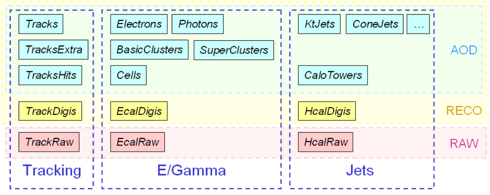
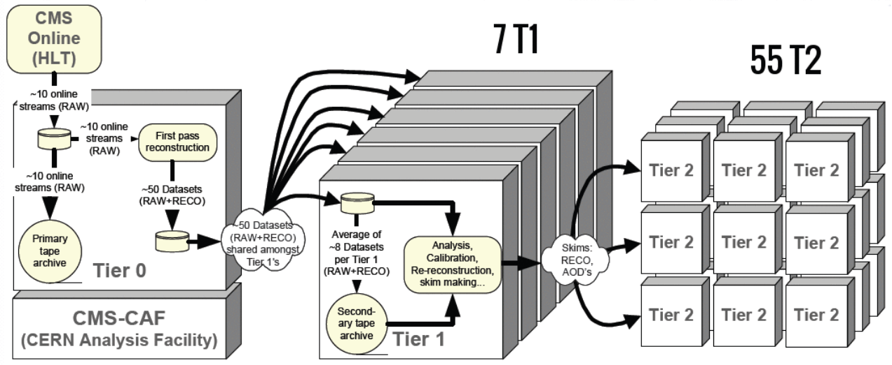

CMS data follows a complex processing path after making it through the trigger selections you learned about in a previous lesson.
The **primary datasets** begin with raw data events that have passed one or more of a certain set of triggers. For this workshop
our test case is Higgs -> tau tau, so we analyze events in the "TauPlusX" primary dataset. Other datasets are defined for muon, electron,
jet, MET, b-tagging, charmonium, and other trigger sets.

## Skimming

Performing physics analyses with the raw primary datasets would be impossible! The datasets go through a processing of **skimming** (or also
slimming, thinning, etc) to reduce their size and increase their usability -- both by reducing the number of events and compressing the event format by removing
information that is no longer needed. Data is processed through the following steps:

 * RAW -> RECO: first reconstruction. Detector-level information is passed through reconstruction algorithms. Tracking, vertexing, and particle flow are performed
 in this step and basic physics object collections are created. Very CPU-intensive!
 * RECO -> AOD: reduction to objects (Analysis Object Data). Only some hits and other detector-level info is kept, prioritizing physics object collections and some
 supporting information from RECO. In Run 1 this size file was suitable for analyzers. 
 * AOD -> MiniAOD: slimming of objects. AOD-level objects are passed through more selection and standard algorithms are run (such as JEC) so that information can be discarded.
 The MiniAOD format is based on CMS's "Physics Analysis Toolkit" (PAT) object classes, which were originally developed for analysis-specific skims of AOD files.
 * MiniAOD -> NanoAOD: further slimming of objects and flattening of the tree format. NanoAOD is currently the most compact CMS analysis format that contains
 only information about high-level objects in a "flat" ROOT tree format. NanoAOD is expected to have enough information for about 50% of CMS analyses. 

The figure below shows example for tracking, ECAL, and HCAL-based objects. 

## Storage & processing

As the data is being skimmed it is also moving around the world. All RAW data is stored on tape in two
copies, and the the RECO and AOD files are stored at various "tier 1" and "tier 2" computing centers
around the world. The major Tier 1 center for the USA is at Fermilab. Several "tier 3" computing centers
exist at universities and labs to store user-derived data for physics analyses.

More information about the CMS data flow can be found in the [public workbook](https://twiki.cern.ch/twiki/bin/view/CMSPublic/WorkBookChapter2).



